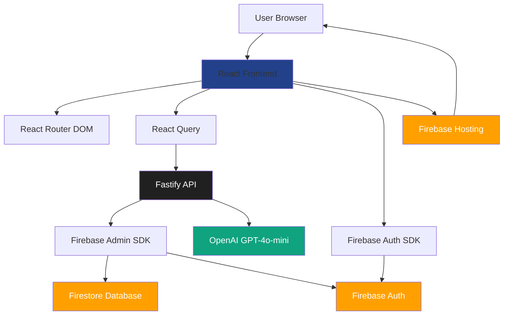

# Bahá'í Translation Workbench (Demo Overview)

A web-based translation workbench designed to support Bahá'í translators in Southeast Asia.  
It provides *AI-assisted translation suggestions*, organized *paragraph-by-paragraph editing*, and a *custom terminology glossary* to ensure consistency across collaborative translations.

This repository is a **demo + documentation hub** for the project.  
The actual application is private-access only due to user data, but this README explains the architecture, workflow, decisions, and includes a short demo video.

---

## ✨ Key Features

- **Human-in-the-loop translation workflow**  
  AI provides suggestions, but users review and decide final wording.

- **Paragraph-by-Paragraph Editing**  
  Avoids overwhelming pages of text and enables careful refinement.

- **Terminology Glossary Support**  
  Users can upload preferred translations for spiritual / conceptual terms.  
  These are automatically injected into model prompts for consistency.

- **Private Accounts & Secure Document Storage**  
  Users log in, upload documents, and work in their own environment.  
  No content is shared unless intentionally exported.

- **Cloud-Hosted & Accessible**  
  Works directly in the browser with no installation required.

---

## 🎥 Demo Video

> **Short video demo:**  
https://www.loom.com/share/6dd6b42854904cd3a7e0f099552f40a7

This video walks through uploading a document, receiving AI suggestions, editing, and applying terminology.

---

## 🖥 Live Application (Restricted Access)

> **Production link:**  
https://bahaitranslationworkbench.web.app/

Access is limited to approved translators.  
If you would like **demo access**, please contact me.

---

## 🏗 Architecture Overview



### System Flow

```
React Frontend (Material-UI)
    ↓
Fastify Node.js Backend API
    ↓
OpenAI GPT-4o-mini (translation + revision suggestions)
    ↓
Firebase Services:
  • Firebase Auth (user accounts)
  • Firestore (terminology, user documents)
  • Firebase Hosting (serving the web app)
```

---

## 🔧 Tech Stack

| Layer | Technology |
|-------|------------|
| **Frontend** | React 18, Vite, Material-UI, React Router DOM, TanStack Query |
| **Backend** | Fastify (Node.js), TypeScript |
| **AI** | OpenAI GPT-4o-mini API |
| **Auth** | Firebase Authentication |
| **Database** | Firestore (NoSQL) |
| **Hosting** | Firebase Hosting |

### Key Libraries

- **Frontend**: React Query for state management, React Hook Form for forms, Axios for HTTP requests
- **Backend**: Firebase Admin SDK for server-side operations, rate limiting, CORS support
- **Validation**: Zod for schema validation

---

## 📚 Documentation

> **User Guide:**  
https://gist.github.com/kaixuankhoo98/c1adbcf2ef8d82db8d84006ff93db820

---

## 🌍 Current Usage

- Used by translators across **Southeast Asia**, including **Pakistan, Thailand, and Malaysia**
- ~ *50+* active users

---

## 🧠 Key Design Considerations

- **Accuracy over automation:** The system assists but does not replace human translators.
- **Terminology-first prompting:** The glossary merges into GPT prompts to preserve spiritual meaning.
- **Gentle learning curve:** UI is structured to prevent overwhelming new users.
- **Privacy and control:** Each account is fully isolated by Firebase Security Rules.

---

## 📍 Future Development

- Collaborative shared projects
- Glossary sharing libraries between communities
- Multi-language translation workflows
- Option to choose between LLMs, configure LLM settings

---

## 👋 Author

**Kaixuan Khoo**  
> Full-stack developer focused on tools that enhance real human workflows.  
> Feel free to reach out for questions, collaboration, or demo access.

**Contact:**
- LinkedIn: https://www.linkedin.com/in/kaixuankhoo/
- Email: kaixuan.khoo.98@gmail.com

---

